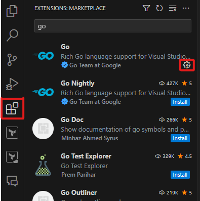

# Plugin for Terraform Provider for Citrix® Developer Guide

This documentation will guide you through the process of setting up your dev environment for running Plugin for Terraform Provider for Citrix® server locally on your dev machine.

## Table of Contents
- [Plugin for Terraform Provider for Citrix® Developer Guide](#plugin-for-terraform-provider-for-citrix-developer-guide)
  - [Table of Contents](#table-of-contents)
  - [Install Dependencies](#install-dependencies)
  - [Load project in VSCode for Go Development](#load-project-in-vscode-for-go-development)
  - [Debugging Provider code in VSCode](#debugging-provider-code-in-vscode)
    - [Add VSCode Launch Configuration](#add-vscode-launch-configuration)
    - [Start Debugger](#start-debugger)
    - [Attach Local Provider to PowerShell](#attach-local-provider-to-powershell)
  - [Debugging with citrix-daas-rest-go client code in Visual Studio Code](#debugging-with-citrix-daas-rest-go-client-code-in-visual-studio-code)
  - [Handling Terraform lists, sets, and nested objects](#handling-terraform-lists-sets-and-nested-objects)
    - [Converting to Go native types](#converting-to-go-native-types)
    - [Initalizing Terraform types](#initalizing-terraform-types)
    - [Preserving order in lists](#preserving-order-in-lists)
  - [Regenerate the documentation](#regenerate-the-documentation)
  - [Running the tests](#running-the-tests)
  - [Commonly faced errors](#commonly-faced-errors)
  - [Plugin for Terraform Provider for StoreFront Developer Guide](#plugin-for-terraform-provider-for-storefront-developer-guide)
- [Plugin for Terraform Provider for Citrix® Debugging Guide](#plugin-for-terraform-provider-for-citrix-debugging-guide)
  - [Orchestration TransactionId](#orchestration-transactionid)
  - [Error: Provider produced inconsistent result after apply](#error-provider-produced-inconsistent-result-after-apply)
    - [Single attribute](#single-attribute)
    - [Inconsistent values for sensitive attribute](#inconsistent-values-for-sensitive-attribute)
  - [Error: Value Conversion Error](#error-value-conversion-error)

## Install Dependencies
* Install Go on your local system: https://go.dev/doc/install
  * `choco install golang`
* Install latest version of Terraform (installing via Chocolatey recommended)
  * `choco install terraform`

## Load project in VSCode for Go Development
Visual Studio Code requires the `Go` extension to be able to load go projects, resolve internal references and even cross package references. Once the `Go` extension is installed, you should be able to load `terraform-provider-citrix` in VSCode. `Go` plugin requires the `go.mod` file to be in the root work directory when you load the project.

## Debugging Provider code in VSCode

### Add VSCode Launch Configuration

In order to debug the terraform provider module locally, you will need to setup a VS debugger config for the go project. Create `terraform-provider-citrix/.vscode/launch.json` and add the following configuration block:

```json
{
    "configurations": [
        {
            "name": "Debug Terraform Provider",
            "type": "go",
            "request": "launch",
            "mode": "debug",
            // this assumes your workspace is the terraform-provider-citrix directory
            "program": "${workspaceFolder}",
            "env": {},
            "args": [
                "-debug",
            ]
        }
    ]
}
```

### Start Debugger

Once you have the debug config setup, you can hit `Run` on the VSCode debugger. You should see the following output on the debugger console:

```powershell
Starting: C:\Users\{local user}\go\bin\dlv.exe dap --listen=127.0.0.1:54615 from {Root of repo}\terraform-provider-citrix
DAP server listening at: 127.0.0.1:54615
Type 'dlv help' for list of commands.
{"@level":"debug","@message":"plugin address","@timestamp":"2023-05-22T15:21:11.753013-04:00","address":"127.0.0.1:54834","network":"tcp"}
Provider started. To attach Terraform CLI, set the TF_REATTACH_PROVIDERS environment variable with the following:

    Command Prompt:	set "TF_REATTACH_PROVIDERS={"registry.terraform.io/citrix/citrix":{"Protocol":"grpc","ProtocolVersion":6,"Pid":38724,"Test":true,"Addr":{"Network":"tcp","String":"127.0.0.1:54834"}}}"
    PowerShell:	$env:TF_REATTACH_PROVIDERS='{"registry.terraform.io/citrix/citrix":{"Protocol":"grpc","ProtocolVersion":6,"Pid":38724,"Test":true,"Addr":{"Network":"tcp","String":"127.0.0.1:54834"}}}'
```

### Attach Local Provider to PowerShell

Start a PowerShell session for running your terraform cli for debugging, and copy paste the following command:

    $env:TF_REATTACH_PROVIDERS='{"registry.terraform.io/citrix/citrix":{"Protocol":"grpc","ProtocolVersion":6,"Pid":38724,"Test":true,"Addr":{"Network":"tcp","String":"127.0.0.1:54834"}}}'

Now you are good to run terraform jobs to debug the provider code. Make sure to re-attach the provider server everytime you restart the debugger as the port can change per debugging session.

## Debugging with citrix-daas-rest-go client code in Visual Studio Code

Optionally, you can also debug [citrix-daas-rest-go](https://github.com/citrix/citrix-daas-rest-go) client, which is the Citrix DaaS Rest client for Go. By debugging with the go client, you can inspect the raw response and error message from Citrix DaaS APIs by setting up breakpoints in provider. You can also check the function implementation and models the provider server uses.

Clone the Go client from <https://github.com/citrix/citrix-daas-rest-go>. Go to `terraform-provider-citrix/go.mod` and uncomment the following line to intercept `citrix-daas-rest-go` client with local package:

    replace github.com/citrix/citrix-daas-rest-go => {your local repo directory}/citrix-daas-rest-go

Run [Debugging Provider code in Visual Studio Code](#debugging-provider-code-in-visual-studio-code) again and you will be able to step into the client functions.

Set a breakpoint in `terraform-provider-citrix/internal/provider/provider.go::Configure`

## Handling Terraform lists, sets, and nested objects
### Converting to Go native types
When the Terraform configuration, state, or plan is being converted into a Go model we must use `types.List`, `types.Set`, and `types.Object` rather than go native slices and structs. This is in order to support Null/Unknown values. Unknown is especially important because any variables in the .tf configuration files can be unknown in `ValidateConfig` and `ModifyPlan`. However, handling these Terraform List and Object types is cumbersome as they are dynamically typed at runtime. See [this doc](https://developer.hashicorp.com/terraform/plugin/framework/handling-data/accessing-values) for more information. 

In order to reduce errors this project has introduced a system to convert between Terraform List/Set/Object and Go native slices/structs. When data needs to be operated on it should be first converted to the Go native representation, then converted back to the Terraform representation. The following helper methods can handle this for you.

| From | To | Function | Notes |
|------|----|----------|-------|
| `types.Object` | `T` | `ObjectValueToTypedObject` | `T` must implement `ResourceModelWithAttributes` or `DataSourceModelWithAttributes` |
| `T` | `types.Object` | `TypedObjectToObjectValue` | `T` must implement `ResourceModelWithAttributes` |
| `T` | `types.Object` | `DataSourceTypedObjectToObjectValue` | `T` must implement `DataSourceModelWithAttributes` |
| `types.List` | `T[]` | `ObjectListToTypedArray[T]` | `T` must implement `ResourceModelWithAttributes` or `DataSourceModelWithAttributes`. For a list of nested objects |
| `T[]` | `types.List` | `TypedArrayToObjectList[T]` | `T` must implement `ResourceModelWithAttributes`. For a list of nested resource objects |
| `T[]` | `types.List` | `DataSourceTypedArrayToObjectSet[T]` | `T` must implement `DataSourceModelWithAttributes`. For a list of nested data source objects |
| `types.Set` | `T[]` | `ObjectSetToTypedArray[T]` | `T` must implement `ResourceModelWithAttributes`. For a set of nested objects |
| `T[]` | `types.Set` | `TypedArrayToObjectSet[T]` | `T` must implement `ResourceModelWithAttributes`. For a set of nested resource objects |
| `T[]` | `types.Set` | `DataSourceTypedArrayToObjectSet[T]` | `T` must implement `DataSourceModelWithAttributes`. For a set of nested data source objects |
| `types.List` | `string[]` | `StringListToStringArray` | For a list of strings |
| `string[]` | `types.List` | `StringArrayToStringList` | For a list of strings |
| `types.Set` | `string[]` | `StringSetToStringArray` | For a set of strings |
| `string[]` | `types.Set` | `StringArrayToStringSet` | For a set of strings |

In order to use the first 9 of these methods, the struct `T` needs to implement the [ResourceModelWithAttributes](internal/util/types.go) or [DataSourceModelWithAttributes](internal/util/types.go) interface which is ultimately populated from the attribute's Schema. This gives the Terraform type system the necessary information to populate a `types.Object` or `types.List` with a nested object.

### Initalizing Terraform types
When dealing with a struct that contains nested `types.List/Set/Object`, it is important to never work with an empty struct, but instead start with one that has all of the nested objects initialized to Terraform's `ListNull/SetNull/ObjectNull`. There are helpers to assist with this:
```
// Do not do this:
tfObject := ComplexTerraformObject{}
// or this:
tfObject ComplexTerraformObject

// Instead:
if attributesMap, err := util.ResourceAttributeMapFromObject(ComplexTerraformObject{}); err == nil {
    tfObject := types.ObjectNull(attributesMap)
} else {
    diagnostics.AddWarning("Error when creating null ComplexTerraformObject", err.Error())
}
```

The issue is that the `AttributeMap` for nested objects, and the `ElementType` for nested lists/sets will not be configured. This will lead to hard to debug errors like `Error: Value Conversion Error` (see its debugging section below). Terraform cannot work with `nil`s on attribute, it must be wrapped in a Terraform null object.

### Preserving order in lists
Often time the order of elements in a list does not matter to the service. In this case one of the following helper functions should be used. These functions will get state list in sync with the remote list while preserving the order in the state when possible. 

| Function | Input | Notes |
|----------|-------|-------|
| `RefreshList` | `[]string` | |
| `RefreshUsersList` | `types.Set` | Will ensure users are not duplicated by UPN or SAMname |
| `RefreshListValues` | `types.List` of `string` | |
| `RefreshListValueProperties` | `types.List` of `types.Object` | Each element will have its `RefreshListItem` method called. The element's type must implement the `RefreshableListItemWithAttributes` interface |

## Regenerate the documentation
This project uses [terraform-plugin-docs](https://github.com/hashicorp/terraform-plugin-docs) to autogenerate its documentation from the source code. Whenever names, descriptions, or examples change be sure to run the following command to update the [docs/](docs/).
```powershell
➥ cd {Root of repo}/terraform-provider-citrix
➥ go generate ./...
```

## Running the tests

Before running the tests, you need to provide values for environment variables required by the test files. 
The environment parameters that need to be specified can be found in the following template files:
1. To Run Tests for the Cloud Environment: `settings.cloud.example.json`
2. To Run Tests for the On-Premise environment: `setings.onprem.example.json`

Copy the environment parameters from the appropriate template file and paste them in the GO `settings.json` file.
To navigate to `settings.json` file, follow the steps below:
1. Click on the `Extensions` icon on the left panel of VS Code.
2. Search for the `Go` extension and click on the `gear` icon next to it. 

    

3. In the search bar, type in `go.testEnvVars`. From the search result, click on `Edit in settings.json` under `Go: Test Env Vars`.
4. Paste the contents of the template file that you copied earlier.
5. Update the missing values in the file and run the commands mentioned below

```powershell
➥ cd {Root of repo}/terraform-provider-citrix
➥ $env:TF_ACC = 1
➥ go test -count=1 -run='{name of resource to test}' -v ./internal/test
```

## Commonly faced errors
```powershell
    error obtaining VCS status: exit status 128
        Use -buildvcs=false to disable VCS stamping.
    exit status 1
```

To solve this issue, run the following command at the root of the repository:
```powershell
    git config --global --add safe.directory [path to dir/repo]
```

## Plugin for Terraform Provider for StoreFront Developer Guide

The test running process is the same as [Running the tests](#running-the-tests) with additional parameter in the settings.cloud.example.json or settings.onprem.example.json  `StoreFront env variable` section


# Plugin for Terraform Provider for Citrix® Debugging Guide
If not running in VSCode enable Terraform logs using:
```
$env:TF_LOG="DEBUG"
$env:TF_LOG_PATH="./citrix-provider-issue.txt"
terraform <command>
```

## Orchestration TransactionId
Filter the logs for `Orchestration API request` and find the request in question. On the same line is a `transactionId`. On-premises customers can search the [CDF logs](https://support.citrix.com/s/article/CTX127131-how-to-collect-a-citrix-diagnostic-facility-cdf-trace-at-system-startup?language=en_US) for the `transactionId` to find more information about what may have gone wrong. For cloud customers, Citrix support or the developers on this GitHub repository can use the `transactionId`.

## Error: Provider produced inconsistent result after apply
This error comes from the Terraform framework and indicates that after a Create or Update call, there are some properties in the plan which do not match the state.

### Single attribute
Usually the error will contain the exact attribute which has the issue, for example from #52:
```
│ Error: Provider produced inconsistent result after apply
│
│ When applying changes to citrix_machine_catalog.example, provider "provider[\"citrix/citrix\"]" produced an unexpected new value: .minimum_functional_level: was cty.StringVal("L7_34"),    
│ but now cty.StringVal("L7_20").
```

In this case check the given attribute in the result from the final `RefreshPropertyValues` before it is saved to the state. It should not match what was in the plan. Trace backwards in the function to find where it is getting set and figure out why that isn't working. Or if it isn't being set write code to set it.

### Inconsistent values for sensitive attribute
If the error is from a deeply nested attribute, Terraform might return something like this from #120:
```
│ Error: Provider produced inconsistent result after apply
│
│ When applying changes to citrix_machine_catalog.DaaSMachineCatalog, provider "provider["registry.
| terraform.io/citrix/citrix"]" produced an unexpected new value: .provisioning_scheme: inconsistent
| values for sensitive attribute.
```

Because there is a sensitive attribute somewhere in the object, Terraform will not show us more details. If you are able to reproduce this locally, try doing a `plan` after the failure. The resource should be tainted and the properties which were inconsistent will be in the plan output.

Looking at the logs alone there is some information to be found. Filter for `Value switched to prior value due to semantic equality logic`. These are the attributes which have successfully been saved. Using process of elimination on the `tf_attribute_path`, it is possible to see which attribute failed and is not present. If there are nested objects, when the object itself (not its attributes) is listed in `tf_attribute_path` that means the entire object was able to be saved. For example if you see:
```
tf_attribute_path=provisioning_scheme.azure_machine_config.writeback_cache.wbc_disk_storage_type
tf_attribute_path=provisioning_scheme.azure_machine_config.writeback_cache.writeback_cache_disk_size_gb
tf_attribute_path=provisioning_scheme.azure_machine_config.writeback_cache.writeback_cache_memory_size_mb
```
But not `provisioning_scheme.azure_machine_config.writeback_cache`, that means some other attributes of `writeback_cache` had an issue.

## Error: Value Conversion Error
When using our custom types system (see the `Handling Terraform lists/sets and nested objects` section), if something is wrong with the object the provider writes to the state file, Terraform will return something like this from #118:
```
│ Error: Value Conversion Error
│
│ An unexpected error was encountered while verifying an attribute value matched its expected type to prevent unexpected behavior or panics. This is always an
│ error in the provider. Please report the following to the provider developer:
│
│ Expected framework type from provider logic: types.ObjectType["reboot_duration":basetypes.Int64Type, "warning_duration":basetypes.Int64Type,
│ "warning_message":basetypes.StringType, "warning_repeat_interval":basetypes.Int64Type] / underlying type: tftypes.Object["reboot_duration":tftypes.Number,    
│ "warning_duration":tftypes.Number, "warning_message":tftypes.String, "warning_repeat_interval":tftypes.Number]
│ Received framework type from provider logic: types.ObjectType[] / underlying type: tftypes.Object[]
│ Path: image_update_reboot_options
```

If `Received framework type from provider logic` looks empty, that means that an attribute map was not used to create the object. See the `Initalizing Terraform types` section on how to properly initialize an empty object.

Otherwise the expected framework type and received framework type may closely match. Find where they differ and that is likely an attribute that is not being set, similiar to the `inconsistent result after apply/single attribute` section above.