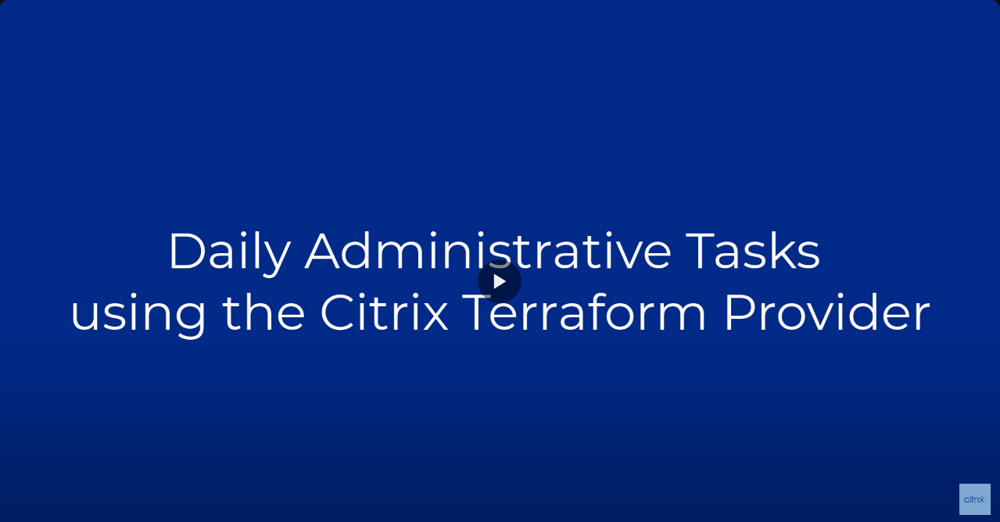

# Plugin for Terraform Provider for Citrix®

Citrix has developed a custom Terraform provider for automating Citrix product deployments and configurations. Using [Terraform](https://www.terraform.io) with Citrix provider, you can manage your Citrix products via Infrastructure as Code, giving you higher efficiency and consistency on infrastructure management, as well as better reusability on infrastructure configuration. The provider is developed and maintained by Citrix.

## Table of Contents
- [Plugin for Terraform Provider for Citrix®](#plugin-for-terraform-provider-for-citrix)
  - [Table of Contents](#table-of-contents)
  - [Contacting the Maintainers](#contacting-the-maintainers)
  - [Examples](#examples)
    - [Deployment guides](#deployment-guides)
    - [Demo video](#demo-video)
  - [Related Citrix Automation Repositories](#related-citrix-automation-repositories)
  - [Plugin for Terraform Provider for Citrix® Documentation](#plugin-for-terraform-provider-for-citrix-documentation)
    - [Navigating the repository](#navigating-the-repository)
    - [Provider Configuration](#provider-configuration)
    - [Resource Configuration](#resource-configuration)
  - [Using the Plugin for Terraform Provider for Citrix DaaS™](#using-the-plugin-for-terraform-provider-for-citrix-daas)
    - [Install Terraform](#install-terraform)
    - [(On-Premises Only) Enable Web Studio](#on-premises-only-enable-web-studio)
    - [(Cloud Only) Create a Citrix Cloud Service Principal](#cloud-only-create-a-citrix-cloud-service-principal)
    - [Configure your Plugin for Terraform Provider for Citrix DaaS™](#configure-your-plugin-for-terraform-provider-for-citrix-daas)
    - [Start writing Terraform for managing your Citrix DaaS site](#start-writing-terraform-for-managing-your-citrix-daas-site)
    - [Create a Zone in Citrix DaaS as the first step](#create-a-zone-in-citrix-daas-as-the-first-step)
    - [Create a Hypervisor](#create-a-hypervisor)
    - [Create a Hypervisor Resource Pool](#create-a-hypervisor-resource-pool)
    - [Create a Machine Catalog](#create-a-machine-catalog)
    - [Create a Delivery Group](#create-a-delivery-group)
    - [Roadmap Proposal for a Smoother Onboarding Experience](#roadmap-proposal-for-a-smoother-onboarding-experience)
  - [Using the Plugin for Terraform Provider for other Citrix resources](#using-the-plugin-for-terraform-provider-for-other-citrix-resources)
    - [Configure Global App Configuration (GAC) Settings](#configure-global-app-configuration-gac-settings)
    - [Create Citrix Cloud Resource Locations](#create-citrix-cloud-resource-locations)
    - [Managing StoreFront resources](#managing-storefront-resources)
    - [Managing DaaS Quick Deploy resources](#managing-daas-quick-deploy-resources)
  - [Frequently Asked Questions](#frequently-asked-questions)
    - [What resource is supported for different connection types?](#what-resource-is-supported-for-different-connection-types)
    - [What URLs should be whitelisted in order to use the Citrix Terraform provider?](#what-urls-should-be-whitelisted-in-order-to-use-the-citrix-terraform-provider)
    - [How do I get the ID to import a DaaS resource?](#how-do-i-get-the-id-to-import-a-daas-resource)
    - [Are my secrets safe in the Terraform state file?](#are-my-secrets-safe-in-the-terraform-state-file)
      - [Azure Hypervisor](#azure-hypervisor)
      - [Domain Password](#domain-password)
      - [DaaS, Citrix Cloud, and DaaS Quick Deploy resources](#daas-citrix-cloud-and-daas-quick-deploy-resources)
        - [Citrix Cloud Identity Providers resources](#citrix-cloud-identity-providers-resources)
      - [CVAD (On-premises) resources](#cvad-on-premises-resources)
      - [StoreFront resources](#storefront-resources)
      - [WEM resources](#wem-resources)
  - [Attributions](#attributions)
  - [License](#license)

## Contacting the Maintainers
This project uses GitHub to track all issues. See [CONTRIBUTING.md](CONTRIBUTING.md) for more information.

## Examples
Basic example templates for getting started can be found in the repository at [examples/](/examples/README.md)

### Deployment guides
Please refer to [Citrix Tech Zone](https://community.citrix.com/tech-zone/automation/) to find detailed guides on how to deploy and manage resources using the Citrix provider:
- [Installing and configuring the provider](https://community.citrix.com/tech-zone/automation/terraform-install-and-config/)
- [Daily administrative operations](https://community.citrix.com/tech-zone/automation/terraform-daily-administration/)
- [AWS EC2](https://community.citrix.com/tech-zone/build/deployment-guides/terraform-daas-aws/) via MCS
- [AWS WorkSpaces Core](https://community.citrix.com/tech-zone/learn/poc-guides/daas-and-awc-terraform)
- [Azure](https://community.citrix.com/tech-zone/build/deployment-guides/daas-azure-iac) via MCS
- [GCP](https://community.citrix.com/tech-zone/build/deployment-guides/terraform-daas-gcp/) via MCS
- [vSphere](https://community.citrix.com/tech-zone/build/deployment-guides/terraform-daas-vsphere8/) via MCS
- [XenServer](https://community.citrix.com/tech-zone/automation/citrix-terraform-xenserver) via MCS
- [Citrix policies](https://community.citrix.com/tech-zone/automation/cvad-terraform-policies/)

### Demo video
[](https://www.youtube.com/watch?v=c33sMLaCVjY)

https://www.youtube.com/watch?v=c33sMLaCVjY

## Related Citrix Automation Repositories
|            Title            |            Details            |
|-----------------------------|-------------------------------|
| [Packer Image Management Module for Citrix® Virtual Apps and Desktops](https://github.com/citrix/citrix-packer-tools) | Use Packer to create golden images with the Citrix VDA installed and using Citrix best practices. |
| [Citrix Ansible Tools](https://github.com/citrix/citrix-ansible-tools) | Playbooks to install Citrix components using automation such as the VDA. |
| [Site Deployment Module for Citrix® Virtual Apps and Desktops](https://github.com/citrix/citrix-cvad-site-deployment-module) | Uses PowerShell to drive Terraform files to create a fully functional CVAD site. |

## Plugin for Terraform Provider for Citrix® Documentation

### Navigating the repository

1. `internal` folder - Contains the following sub directories:
   * `provider` folder - Contains the Citrix provider implementation for Terraform
   * `daas` folder - Contains all the Citrix DaaS resources libraries that we support through Terraform.
   * `test` folder - Contains the Go tests for both `provider` and all `resources` that we have.
   * `util` folder - Contains general utility functions that can be reused.
2. `examples` folder - Contains the examples for users to use various Citrix resources e.g [zone](examples/resources/citrix_zone) folder contains the resources.tf that illustrates how citrix_zone resource can be used to create a DaaS Zone on target Citrix DaaS site. There are also examples for [Citrix provider](examples/provider) configuration for both Citrix Cloud customer and Citrix on-premises customers. Users can use the examples as a starting point to configure their own Citrix Terraform script.
3. `docs` folder - [resources](docs/resources) - contains the documentation for all resource configurations supported through Terraform. Refer this to understand the properties, accepted values, and how various properties work together for each type of resource. 

### Provider Configuration

`provider.tf` contains the information on target DaaS site where you want to apply configuration.

Depending on whether its managing a Citrix Cloud site, or a Citrix on-premises site, Citrix provider should be configured differently.

Example for on-premises site:

```hcl
provider "citrix" {
    cvad_config = {
      hostname      = "10.71.136.250"  # Optionally set with `CITRIX_HOSTNAME` environment variable.
      client_id     = "${var.domain_admin_id}"  # Optionally set with `CITRIX_CLIENT_ID` environment variable.
      client_secret = "${var.domain_admin_secret}"  # Optionally set with `CITRIX_CLIENT_SECRET` environment variable.
    }
}
```

Example for Cloud site:

```hcl
provider "citrix" {
    cvad_config = {
      customer_id   = "${var.customer_id}"  # Optionally set with `CITRIX_CUSTOMER_ID` environment variable.
      client_id     = "${var.api_key_clientId}"  # Optionally set with `CITRIX_CLIENT_ID` environment variable.
      client_secret = "${var.api_key_clientSecret}"  # Optionally set with `CITRIX_CLIENT_SECRET` environment variable.
    }
}
```

You can use environment variables as stated in the comments above. When running Go tests, always use environment variables so that no credentials or other sensitive information are checked-in to the code.

Below is a table to show the difference between on-premises and Cloud provider configuration:

|              | Cloud                                 | On-Premises                           |
|--------------|---------------------------------------|---------------------------------------|
| environment  | `Production`, `Japan`, `Gov`          | N/A                                   |
| customerId   | Cloud Customer Id                     | N/A                                   |
| hostname     | (Optional) Cloud DDC hostname         | On-Premises DDC Hostname / IP address |
| clientId     | Citrix Cloud service principal ID     | Domain Admin Username                 |
| clientSecret | Citrix Cloud service principal secret | Domain Admin Password                 |

### Resource Configuration

Resources.tf can be used to configure the desired state of the resources that you want to create and manage in your Citrix Services. The example below shows how you can configure a Citrix DaaS Zone in Citrix DaaS service in resource.tf.

**`citrix_zone`**

```hcl
resource "citrix_zone" "example-zone" {
    name                = "example-zone"
    description         = "zone example"
    metadata            = [
        {
            name    = "key1"
            value   = "value1"
        }
    ]
}
```

Please refer the Plugin for Terraform Provider for Citrix DaaS™ documentation such as [docs/resources/zone.md](docs/resources/zone.md) to find out the configurable properties of each type of resources, understand what they do, and what option values are supported.

---------

## Using the Plugin for Terraform Provider for Citrix DaaS™

### Install Terraform

Refer the [Hashicorp documentation](https://learn.hashicorp.com/tutorials/terraform/install-cli) for installing Terraform CLI for your own environment.

### (On-Premises Only) Enable Web Studio

For on-premises sites with version >= 2311 are supported. Web Studio needs to be [installed and configured](https://docs.citrix.com/en-us/citrix-virtual-apps-desktops/install-configure/install-core/install-web-studio.html#install-web-studio-1) for the provider to work.

### (Cloud Only) Create a Citrix Cloud Service Principal
A service principal is an API client which is not associated with an email. It can be given delegated permissions just like a regular administrator. Follow the [Citrix Cloud API Access with Service Principals](https://developer-docs.citrix.com/en-us/citrix-cloud/citrix-cloud-api-overview/get-started-with-citrix-cloud-apis#citrix-cloud-api-access-with-service-principals) guide to create a service principal for your cloud customer. When selecting the service principal's access choose an appropriate DaaS role.

### Configure your Plugin for Terraform Provider for Citrix DaaS™

Refer to section [Provider Configuration](#provider-configuration) to configure the provider for the Citrix DaaS site you want to manage with Terraform.

### Start writing Terraform for managing your Citrix DaaS site

To find all the Citrix DaaS resources manageable via Terraform, understand all the configurable properties for each resource and how they work together, refer documentations for resources in [Citrix Terraform resource documentation](docs/resources). To better understand how the resource is managed via Citrix DaaS Rest API, you can refer the [Citrix DaaS Rest API documentation](https://developer.cloud.com/citrixworkspace/citrix-daas/citrix-daas-rest-apis/docs/overview).

### Create a Zone in Citrix DaaS as the first step

Refer the [DaaS Zone documentation](docs/resources/zone.md) to configure a zone via terraform. 

### Create a Hypervisor

Hypervisor is needed to use your preferred public cloud provider with Citrix DaaS. Refer the [DaaS Hypervisor documentation](docs/resources/azure_hypervisor.md) to configure an Azure hypervisor in a zone via terraform.

### Create a Hypervisor Resource Pool

The hypervisor resource pool defines the network configuration for a hypervisor connection. Refer the [DaaS Hypervisor Resource Pool documentation](docs/resources/azure_hypervisor_resource_pool.md) to configure an Azure hypervisr resource pool via terraform.

### Create a Machine Catalog

A machine catalog is a collection of machines managed as a single entity. Refer the [DaaS Machine Catalog documentation](docs/resources/machine_catalog.md) to configure a machine catalog via terraform.

### Create a Delivery Group
A delivery group is a collection of machines selected from one or more machine catalogs. The delivery group can also specify which users can use those machines, plus the applications and desktops available to those users. Refer the [DaaS Delivery Group documentation](docs/resources/delivery_group.md) to configure a delivery group via terraform.

### Roadmap Proposal for a Smoother Onboarding Experience
To streamline your onboarding experience with the Citrix Terraform Provider, we recommend to start small by importing or creating one or two resources and build out from there.

#### Import Your Existing Resources Using the Onboarding Script
Use our [Onboarding Script](https://github.com/citrix/terraform-provider-citrix/blob/main/scripts/onboarding-helper/) with the following parameters to import existing resources and create Terraform configuration files for them.

- Use the `-ResourceTypes` parameter to specify just a few resource types (for example `citrix_zone`, `citrix_delivery_group`)
- Use the `-NamesOrIds` parameter to filter for specific resources by name or ID

Example:
```powershell
.\terraform-onboarding.ps1 CustomerId "{CustomerId}" -ClientId "{ClientId}" -ClientSecret "{ClientSecret}" -ResourceTypes "citrix_zone","citrix_delivery_group" -NamesOrIds "Primary Zone","Sales Delivery Group"
```

This incremental approach allows you to become familiar with Terraform concepts and the Citrix provider while working with a smaller, more focused set of resources.

#### Manual Configuration
Alternatively, we recommend starting by creating new `.tf` files for the core resources essential for a Citrix deployment:

- [citrix_cloud_resource_location](https://registry.terraform.io/providers/citrix/citrix/latest/docs/resources/cloud_resource_location) (for Citrix Cloud customers only)
- [citrix_zone](https://registry.terraform.io/providers/citrix/citrix/latest/docs/resources/zone)
- citrix_{hosting provider}_hypervisor
- citrix_{hosting provider}_hypervisor_resource_pool

These resources are straightforward to configure and can be created or removed quickly. Begin your Terraform journey with these resources to build confidence in managing your Citrix deployment via Terraform.

Once these resources are properly configured, the next step is to set up your [machine catalog](https://registry.terraform.io/providers/citrix/citrix/latest/docs/resources/machine_catalog) with Terraform. Managing the machine catalog with Terraform will provide a solid foundation for designing a pipeline that meets your specific use case.

## Using the Plugin for Terraform Provider for other Citrix resources

### Configure Global App Configuration (GAC) Settings

The Global App Configuration service provides a centralized setup for IT admins to easily configure Citrix Workspace app settings on Windows, Mac, Android, iOS, HTML5, Chrome OS platforms. Please refer to [Global App Configuration settings documentation](docs/resources/gac_settings.md) to configure GAC settings via terraform.

### Create Citrix Cloud Resource Locations

Resource locations contain the resources (e.g. cloud connectors) required to deliver applications and desktops to users. Resource locations are only supported for Cloud customers. On-premises customers can use the zone resource directly. Please refer to [Citrix Resource Location documentation](docs/resources/resource_location.md) to configure citrix cloud resource locations via terraform.

### Managing StoreFront resources
Please refer to the [StoreFront.md](StoreFront.md) to configure StoreFront resources via terraform. Note that this feature is in Tech Preview.

### Managing DaaS Quick Deploy resources
QuickCreate service allows customers to create and manage Amazon WorkSpaces Core instances in Amazon Web Services (AWS). Please refer to the [QuickCreate documentation](https://docs.citrix.com/en-us/citrix-daas/install-configure/amazon-workspaces-core.html) to learn more. Note that this feature is in Tech Preview.

## Frequently Asked Questions

### What resource is supported for different connection types?

| Connection Type                            |   Hypervisor       |   Resource Pool    |  MCS Power Managed       | MCS Provisioning         |         PVS        | Manual/Remote PC           |
|--------------------------------------------|--------------------|--------------------|--------------------------|--------------------------|--------------------|----------------------------|
| AzureRM                                    |:heavy_check_mark:  | :heavy_check_mark: | :heavy_check_mark:       | :heavy_check_mark:       | :heavy_check_mark: | :heavy_check_mark:         |
| AWS EC2                                    |:heavy_check_mark:  | :heavy_check_mark: | :heavy_check_mark:       | :heavy_check_mark:       | N/A                | :heavy_check_mark:         |
| Amazon WorkSpaces Core (**Techpreview**)   |:heavy_check_mark:  | :heavy_check_mark: | :heavy_check_mark:       | :heavy_check_mark:       | N/A                | :heavy_check_mark:         |
| GCP                                        |:heavy_check_mark:  | :heavy_check_mark: | :heavy_check_mark:       | :heavy_check_mark:       | N/A                | :heavy_check_mark:         |
| vSphere                                    |:heavy_check_mark:  | :heavy_check_mark: | :heavy_check_mark:       | :heavy_check_mark:       | N/A                | :heavy_check_mark:         |
| XenServer                                  |:heavy_check_mark:  | :heavy_check_mark: | :heavy_check_mark:       | :heavy_check_mark:       | N/A                | :heavy_check_mark:         |
| Nutanix                                    |:heavy_check_mark:  | :heavy_check_mark: | :heavy_check_mark:       | :heavy_check_mark:       | N/A                | :heavy_check_mark:         |
| SCVMM                                      |:heavy_check_mark:  | :heavy_check_mark: | :heavy_check_mark:       | :heavy_check_mark:       | N/A                | :heavy_check_mark:         |
| Red Hat OpenShift (**Techpreview**)        |:heavy_check_mark:  | :heavy_check_mark: | :heavy_check_mark:       | :heavy_check_mark:       | N/A                | :heavy_check_mark:         |
| HPE Moonshot (**Techpreview**)             |:heavy_check_mark:  | N/A                | :heavy_check_mark:       | N/A                      | N/A                | :heavy_check_mark:         |
| Remote PC Wake On LAN (**Techpreview**)    |:heavy_check_mark:  | N/A                | N/A                      | N/A                      | N/A                | :heavy_check_mark:         |

### What URLs should be whitelisted in order to use the Citrix Terraform provider?
- URLs of the Citrix admin consoles: please visit [this documentation](https://docs.citrix.com/en-us/citrix-cloud/overview/requirements/internet-connectivity-requirements.html) for more information.
- URL of the HashiCorp Terraform registry: https://registry.terraform.io or a private registry.

### How do I get the ID to import a DaaS resource?
The [Object IDs Helper Script](https://github.com/citrix/terraform-provider-citrix/blob/main/scripts/object-ids-helper/) will discover all resource IDs and save them to a JSON file for easy reference.

Alternatively the IDs can be found in Web Studio by looking at the network traces. Open your browser developer tools (usually F12) and navigate to the `Network` tab. Refresh Web Studio and click on the resource you want to find the ID for. There should be 2 corresponding network calls (`OPTIONS` then `GET`) for the resource which includes the ID as the last path in the url before the `?` query.

For example in this network call the delivery group ID is `9e451353-d41c-40d5-80da-37177680364b`:
```
OPTIONS https://customerId.xendesktop.net/citrix/orchestration/api/customerId/e4c48b1c-0c2c-4ede-b9a2-ec34998ab118/DeliveryGroups/9e451353-d41c-40d5-80da-37177680364b?fields=SimpleAccessPolicy%2C...
```

### Are my secrets safe in the Terraform state file?
When you use Terraform, any secret in the resource configuration will be stored in the state file. Terraform has guidance to handle the state file itself as sensitive: https://developer.hashicorp.com/terraform/language/state/sensitive-data. This can be mitigated by using a remote state file with encryption enabled. 

It is still best to avoid putting secrets in the state file, and DaaS has a few options to avoid storing secrets in the state:
#### Azure Hypervisor 
MCS offers the option to use the managed identity of the Citrix Cloud Connector to call Azure APIs instead of the application ID + secret. See the [Citrix docs](https://docs.citrix.com/en-us/citrix-daas/install-configure/connections/connection-azure-resource-manager.html#create-a-host-connection-using-azure-managed-identity) for this feature and the [provider docs](https://registry.terraform.io/providers/citrix/citrix/latest/docs/resources/service_account#authentication_mode-1)
```
resource "citrix_azure_hypervisor" "example-azure-hypervisor" {
    name                = "example-azure-hypervisor"
    zone                = "<Zone Id>"
    active_directory_id = "<Azure Tenant Id>"
    subscription_id     = "<Azure Subscription Id>"
    authentication_mode = "SystemAssignedManagedIdentity" // or "UserAssignedManagedIdentities"
    proxy_hypervisor_traffic_through_connector = true
}
```

#### Domain Password
A domain user is required for the `citrix_machine_catalog` resource to create and manage AD machine accounts for the VDAs. This can be pre-created as a Service Account in Web Studio and then imported into Terraform. The machine catalog will then use the credentials stored on the DDC to communicate with AD. See the [citrix_service_account](https://registry.terraform.io/providers/citrix/citrix/latest/docs/resources/service_account) and [citrix_machine_catalog](https://registry.terraform.io/providers/citrix/citrix/latest/docs/resources/machine_catalog#service_account_id-1) docs.
```
resource citrix_service_account "example-service-account" {
    // These values should match what was entered in Web Studio to ensure the import is successful
    display_name = "example-ad-service-account"
    identity_provider_type = "ActiveDirectory"
    identity_provider_identifier = "<DomainFQDN>"
    account_id = "<Domain>\\<Admin Username>"
    account_secret_format = "PlainText"

    // the actual secret is already in remote, putting a dummy value here and setting to ignore changes because this argument is required
    account_secret = "dummy secret for import" 
    lifecycle {
        ignore_changes = [account_secret]
    }
}

// terraform import citrix_service_account.example-service-account <service account ID>

resource "citrix_machine_catalog" "dj-test" {
    provisioning_scheme = {
        machine_domain_identity = {
            domain             = "<DomainFQDN>"
            // use the imported service account when creating this catalog
            service_account_id = citrix_service_account.cmdlab-service-account.id
    ...
```

#### DaaS, Citrix Cloud, and DaaS Quick Deploy resources
- https://api.cloud.com
- Or for Japan environment: https://api.citrixcloud.jp
- Or for Gov environment: `https://[customerId].xendesktop.us` and `https://*.citrixworkspacesapi.us`

##### Citrix Cloud Identity Providers resources
- https://cws.citrixworkspacesapi.net
- Or for Japan environment: https://cws.citrixworkspacesapi.jp
- Or for Gov environment: https://cws.citrixworkspacesapi.us
 
#### CVAD (On-premises) resources
- Hostname of the DDC

#### StoreFront resources
- Hostname of the StoreFront Server
- Hostname of the DDC

#### WEM resources
- US environment: https://api.wem.cloud.com
- EU environment: https://eu-api.wem.cloud.com
- APS environment: https://aps-api.wem.cloud.com
- Japan environment: https://jp-api.wem.citrixcloud.jp
  
## Attributions
The code in this repository makes use of the following packages:
-	Hashicorp Terraform Plugin Framework (https://github.com/hashicorp/terraform-plugin-framework)
-	Google Go Uuid (https://github.com/google/uuid)

## License 
This project is Licensed under the Apache License, Version 2.0 (the "License"); you may not use this file except in compliance with the License. You may obtain a copy of the License at http://www.apache.org/licenses/LICENSE-2.0 

Unless required by applicable law or agreed to in writing, software distributed under the License is distributed on an "AS IS" BASIS, WITHOUT WARRANTIES OR CONDITIONS OF ANY KIND, either express or implied. See the License for the specific language governing permissions and limitations under the License.

<sub>Copyright © 2025. Citrix Systems, Inc.</sub>